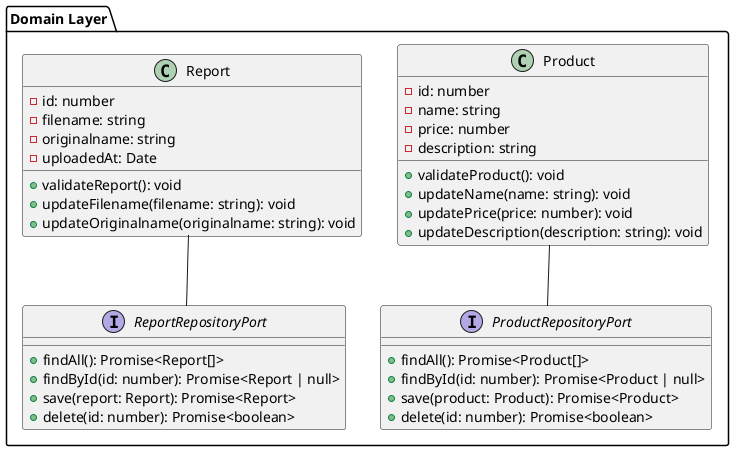
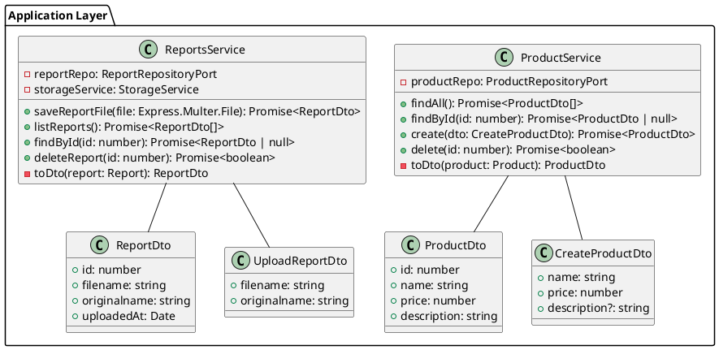
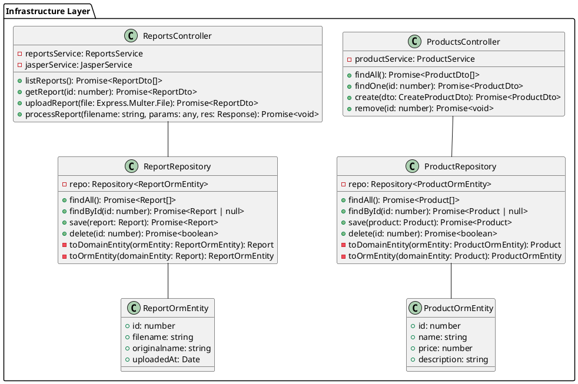
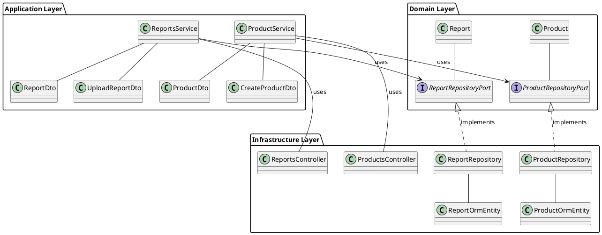
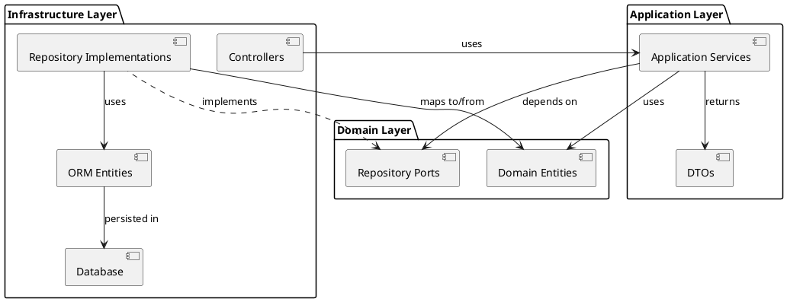

# Hexagonal Architecture Diagram

This document provides a visual representation of the hexagonal architecture (ports and adapters) implemented in this project.

## Domain Layer

## Application Layer

## Infrastructure Layer

## Complete Architecture

## Dependency Flow

This architecture follows the Hexagonal Architecture (Ports and Adapters) pattern, where:

1. The Domain Layer contains the core business logic and defines what it needs from the outside world through ports (interfaces).
2. The Application Layer orchestrates the use of domain entities to fulfill use cases and translates between the domain and the outside world.
3. The Infrastructure Layer implements the adapters that fulfill the ports defined by the domain layer.

The key benefit is that the Domain Layer has no dependencies on the Infrastructure Layer, making it easier to test and maintain.