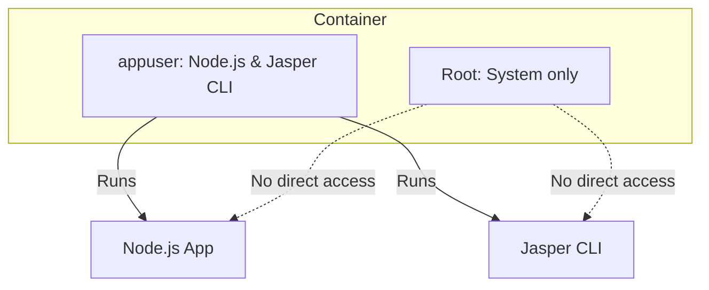

my cv # Docker Security Improvements

## Overview
This project now uses a secure Docker setup for production images:
- The Node.js application runs as a non-root user (`appuser`).
- All application files and directories are owned by `appuser`.
- This reduces the risk of privilege escalation and follows container security best practices.

## Implementation Details
- The Dockerfile creates a dedicated user (`appuser`) and sets ownership of `/app`.
- The final image switches to `appuser` before starting the application.
- Jasper CLI and related files are also owned by `appuser`.

## How to Build and Run
To build the secure image:
```sh
docker build -f Dockerfile -t jasper-reports-nestjs:secure .
```
To run:
```sh
docker run --rm -p 3000:3000 jasper-reports-nestjs:secure
```

## References
- [Docker Security Best Practices](https://docs.docker.com/develop/security/)
- [Node.js Docker Guidelines](https://nodejs.org/en/docs/guides/nodejs-docker-webapp/)

## Architecture Diagram


