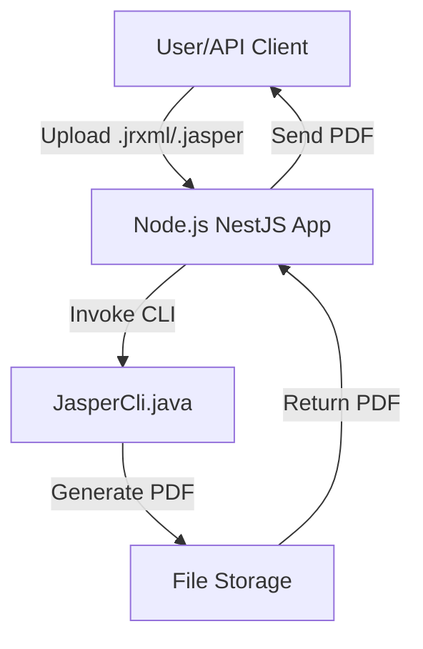

# JasperReports Integration

This document explains how JasperReports is integrated into the NestJS project.

## Overview
- JasperReports is used for processing `.jrxml` and `.jasper` files and generating PDF reports.
- Integration is handled via a custom Java CLI (`JasperCli.java`) invoked from the Node.js backend.

## Flow Diagram


## CLI Usage
- The CLI is built and included in the Docker image.
- Node.js invokes the CLI using child processes for report generation.

## Example Command
```sh
java -cp jasper-engine/* JasperCli input.jrxml output.pdf
```

## Error Handling
- Errors from the CLI are captured and returned as API errors (500 Internal Server Error).

## See Also
- [API Reference](./api-reference.md)
- [Docker Security](./docker-security.md)

